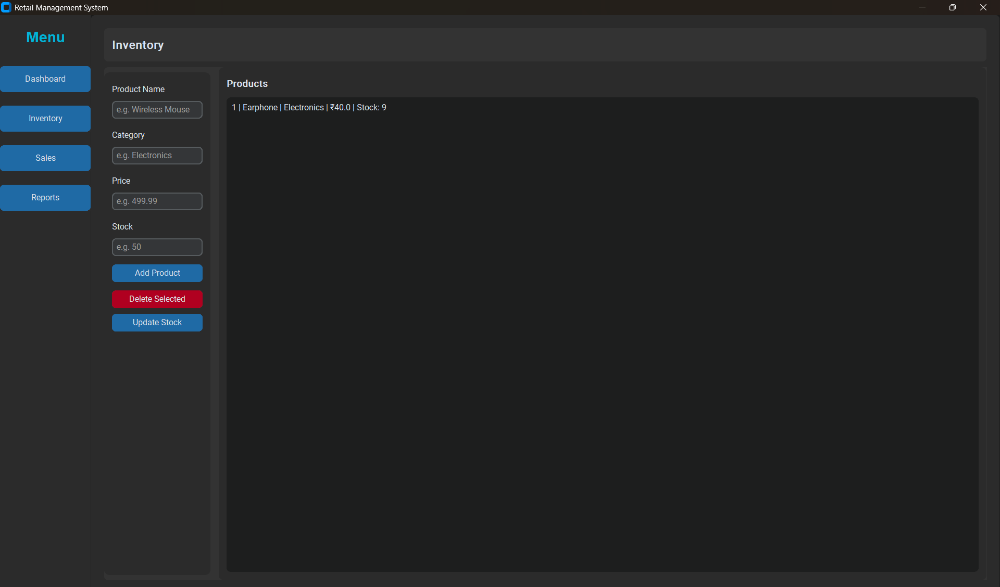
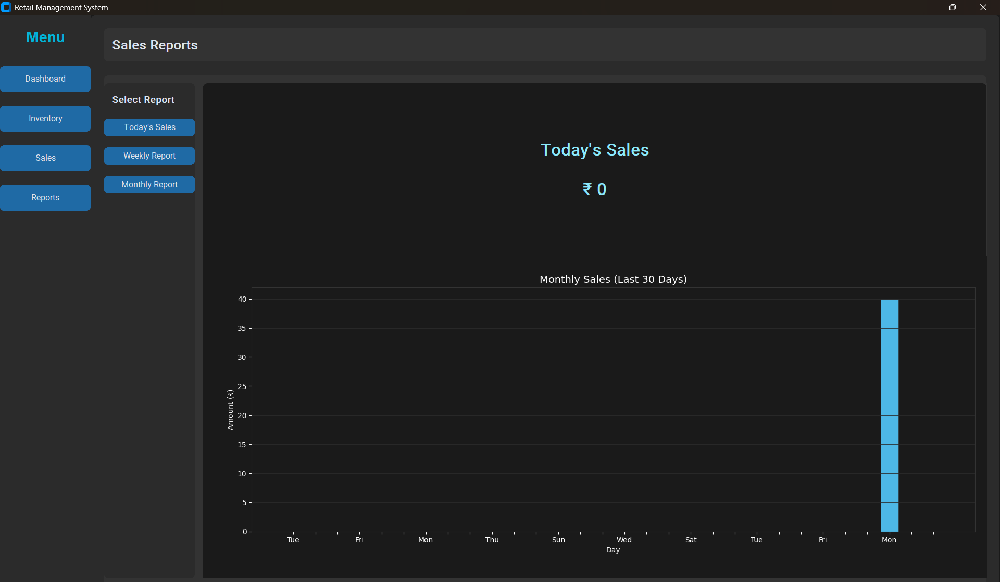
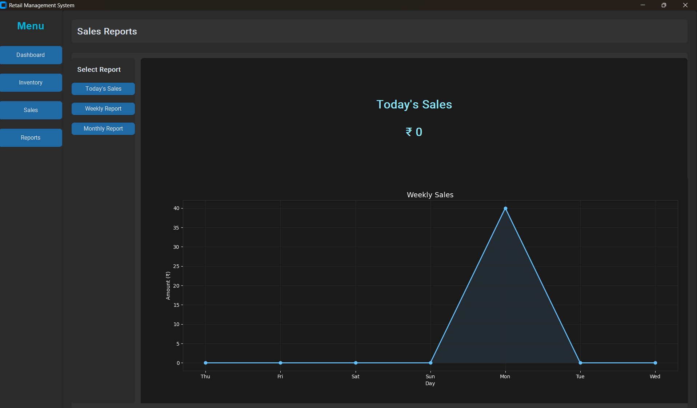

# Retail Management System

A modern Retail Management System built with **Python**, **CustomTkinter**, **SQLite**, and **Matplotlib**.

## Features
- Inventory CRUD
- Sales tracking and billing
- Reports with Weekly/Monthly charts
- Clean sidebar layout
- Modern dark UI

## Installation
```bash
git clone https://github.com/dk1092661-ui/retail-management-system.git
cd retail-management-system
python -m venv .venv
# Windows PowerShell:
.venv\Scripts\Activate.ps1
# Windows CMD:
.venv\Scripts\activate.bat
pip install -r requirements.txt
python -m app.gui.main_app

# Screenshots

## Dashboard


## Inventory Management


## Monthly Report


## Reports


## Sales Summary


## Weekly Overview

