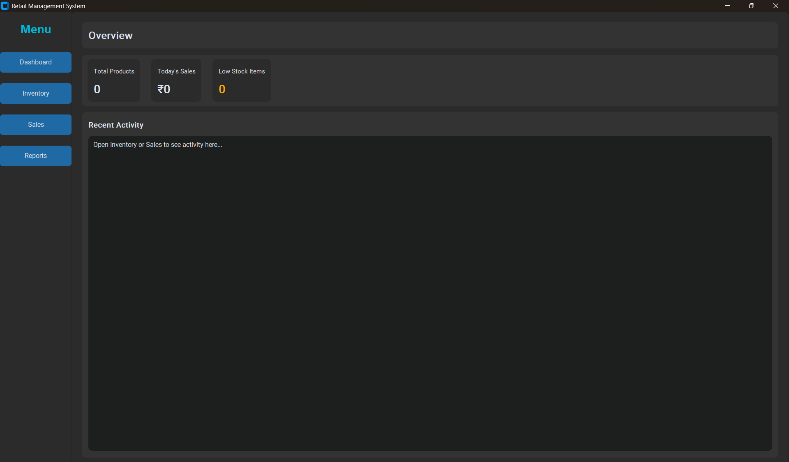
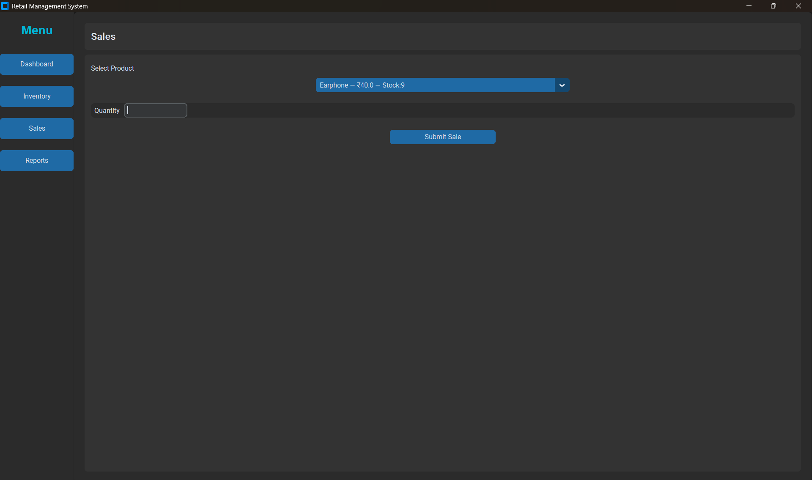
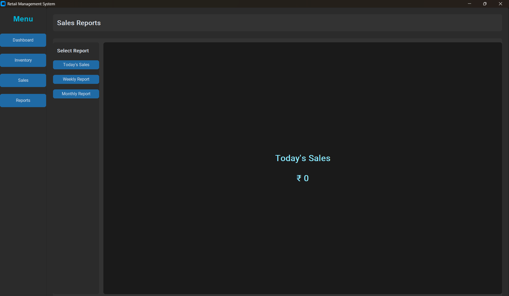

# 🛒 Retail Management System

A fully functional **Desktop-Based Retail Management System** developed using **Python**, **CustomTkinter**, **SQLite**, and **Matplotlib**.  
This application is designed to efficiently manage **inventory, sales operations, and business analytics** with a modern and intuitive user interface.

---

## 📖 Overview

The **Retail Management System** is a lightweight yet powerful desktop application that helps small businesses and retail stores automate daily operations such as:

- Product inventory tracking  
- Sales management  
- Automated stock updates  
- Visual business performance reports  

The system is built with a focus on **usability, performance, and clean architecture** using Object-Oriented Programming.

---

## ✨ Key Features

### 🔹 Inventory Management
- Add, update, and delete products  
- Manage stock levels in real time  
- Categorize products efficiently  

### 🔹 Sales Management
- Process product sales  
- Automatic stock reduction after each sale  
- Real-time display of daily revenue  

### 🔹 Reports & Analytics
- Daily sales summary  
- Weekly sales report  
- Monthly sales report  
- Interactive charts using Matplotlib  

### 🔹 User Interface
- Developed using **CustomTkinter**
- Modern dark UI theme
- Sidebar-based navigation
- Smooth and responsive layout

---

## 🖼️ Application Preview

| Dashboard | Inventory |
|----------|-----------|
|  |  |

| Sales | Reports |
|------|---------|
|  |  |

| Weekly Report | Monthly Report |
|---------------|----------------|
|  |  |

---

## 🛠️ Technologies & Tools

- **Python 3**
- **Tkinter / CustomTkinter**
- **SQLite Database**
- **Matplotlib**
- **Object-Oriented Programming (OOP)**

---

## ⚙️ Installation & Setup (Windows)

1. Clone the repository:
   ```bash
   git clone https://github.com/dk1092661-ui/retail-management-system.git
